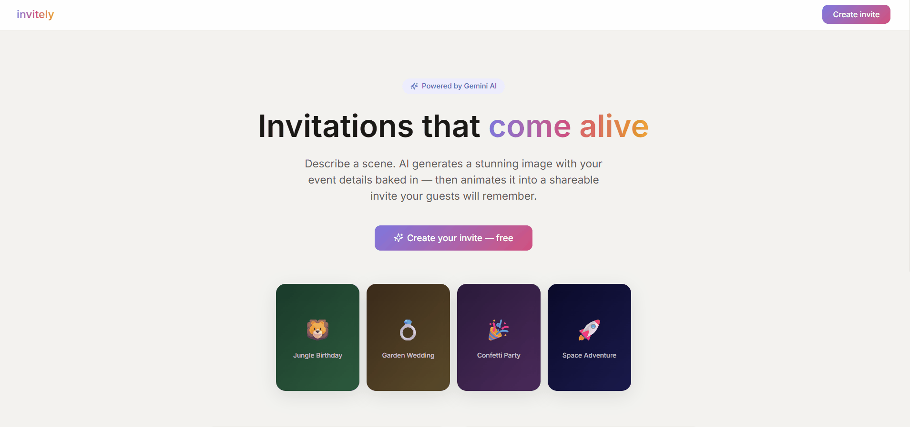

# Invitely — AI Animated Invitation Platform

> Generate beautiful invitation pages using AI. Describe a scene, let AI paint a
> custom invitation — optionally with the event details baked right into the
> artwork — optionally animate it, and share it all through a single short link.

---

## Demo



---

## Tech Stack

| Layer | Technology |
|---|---|
| Backend | Spring Boot 3.3, Java 21 |
| Image generation | Vertex AI **Imagen 3** (clean scene) + **Gemini 2.5 Flash Image** (baked-in card) |
| Prompt suggestions | Gemini 2.0 Flash via Spring AI `ChatModel` |
| Database | PostgreSQL 16 + Flyway migrations |
| Async / Events | Apache Kafka (optional — see below) |
| Asset Storage | AWS S3 in prod, local filesystem in dev |
| Video Generation | Kling AI / Runway ML (pluggable; stub provider in dev) |
| Frontend | React 18, Vite, Framer Motion, Zustand |
| Notifications | SendGrid |

---

## Features

- **Two image modes, one toggle**
  - *Scene mode* — Imagen 3 paints a clean themed scene; the guest page overlays
    the event text with CSS.
  - *Baked-in card mode* — Gemini 2.5 Flash Image composes a full invitation card
    with the title, date and venue rendered directly into the artwork (full-bleed,
    no border). The guest page suppresses its overlay and shows the card in a
    lightbox.
- **Async generation with live status** — image and video generation run on
  background threads and return `202 Accepted`; the frontend polls the invite's
  status (`DRAFT → IMAGE_PENDING → IMAGE_READY → PUBLISHED`, or `FAILED`) until
  it settles. See [Design notes](#design-notes).
- **Animated invites** — a pluggable video provider brings the scene to life; a
  stub provider is used in local dev so the flow works without API keys.
- **RSVP system** — guests respond on the invite page; the host sees an aggregated
  summary (attending / not / maybe / total guests) computed in a single query.
- **Shareable links** — every invite gets an unguessable short slug
  (`/i/abc123`), generated with `SecureRandom`.
- **Event-driven notifications** — when Kafka is enabled, invite/RSVP events fan
  out to a consumer that emails the host via SendGrid.

---

## Project Structure

```
invitely/
├── backend/          # Spring Boot API
│   ├── src/main/java/com/invitely/
│   │   ├── controller/     REST endpoints (invites, AI, templates)
│   │   ├── service/        Business logic, AI integration, status writes
│   │   ├── model/          JPA entities
│   │   ├── repository/     Spring Data repositories
│   │   ├── kafka/          Event producer/consumer (conditional on kafka.enabled)
│   │   ├── config/         Security, S3, Spring AI, static uploads
│   │   └── dto/            Request / response DTOs + global error handler
│   └── src/main/resources/
│       ├── application.yml, application-dev.yml, application-prod.yml
│       └── db/migration/   Flyway SQL migrations (V1–V6)
└── frontend/         # React + Vite app
    └── src/
        ├── pages/          Home, CreateInvite, InvitePage, Dashboard
        ├── components/     Wizard steps, invite card, RSVP form
        ├── api/            Axios client + status-polling helper
        └── store/          Zustand state
```

---

## Getting Started

### Prerequisites

- Java 21, Maven 3.9+
- PostgreSQL 16
- Node 20+
- A Google Cloud project with the **Vertex AI API** enabled (for real image
  generation)
- Kafka is **optional** — the `dev` profile runs without it

### 1. Clone

```bash
git clone https://github.com/jainneerja/invitely.git
cd invitely
```

### 2. Database

Create a `invitely` Postgres database (default local credentials are
`invitely` / `invitely`; override with `DB_USERNAME` / `DB_PASSWORD`). Flyway
runs all migrations automatically on startup.

### 3. Google Cloud credentials (for image generation)

Image generation calls Vertex AI using Application Default Credentials:

```bash
gcloud auth application-default login
gcloud auth application-default set-quota-project YOUR_GCP_PROJECT_ID
```

Set the project via `GOOGLE_CLOUD_PROJECT_ID`.

### 4. Run the backend (dev profile — no Kafka, local file storage, stub video)

```bash
cd backend
mvn spring-boot:run -Dspring-boot.run.profiles=dev
```

### 5. Run the frontend

```bash
cd frontend
npm install
npm run dev
```

Frontend at `http://localhost:3000`, API at `http://localhost:8080`. Vite
proxies `/api` and `/uploads` to the backend.

---

## API Overview

| Method | Endpoint | Description |
|---|---|---|
| `POST` | `/api/invites` | Create a new invitation |
| `GET` | `/api/invites/{slug}` | Guest view by slug (public) |
| `GET` | `/api/invites/id/{id}` | Host view by id, with RSVP summary (poll target) |
| `PATCH` | `/api/invites/{id}` | Partial update (draft only) |
| `POST` | `/api/invites/{id}/publish` · `/unpublish` | Publish / take offline |
| `DELETE` | `/api/invites/{id}` | Delete invite |
| `POST` | `/api/invites/{id}/generate-image?embedText={bool}` | Async image gen → `202` |
| `POST` | `/api/invites/{id}/animate` | Async video animation → `202` |
| `GET` | `/api/invites/suggest-prompt` | AI-suggested scene prompt |
| `POST` | `/api/invites/{slug}/rsvp` | Submit RSVP (public) |
| `GET` | `/api/invites/{id}/rsvp` | List RSVPs (host) |
| `GET` | `/api/templates` | List templates |

---

## Design notes

**Async image/video generation.** The `@Async` methods that call Vertex AI and
the video provider are deliberately **not** `@Transactional` — a transaction
spanning a slow external call would pin a database connection for its whole
duration (up to ~5 min for video polling) and could exhaust the pool. Instead,
status transitions are short, independent transactions on `InviteStatusService`,
a separate bean so the calls cross Spring's transactional proxy. This also makes
the intermediate `IMAGE_PENDING` state observable to the polling frontend, and
lets a failed generation land a durable `FAILED` state instead of being rolled
back. External HTTP clients have explicit connect/read timeouts.

**Kafka is optional.** Producers and the notification consumer are gated by
`@ConditionalOnProperty(kafka.enabled)`; with it off (the dev default) a no-op
stub logs events and the app starts with no broker.

---

## Database Schema

```
invitations       — core invite data + AI generation state (status, embed flag)
templates         — JSON-driven template configs
assets            — uploaded + AI-generated images and videos
rsvp_responses    — guest RSVP submissions
```

Invite status: `DRAFT · IMAGE_PENDING · IMAGE_READY · VIDEO_PENDING · PUBLISHED · FAILED`

---

## Architecture

```
React Frontend
      ↓ REST (poll status)
Spring Boot API
  ├── InviteService        (CRUD, slug, RSVP)
  ├── AIService  @Async ───→ Vertex AI: Imagen 3 / Gemini 2.5 Flash Image
  ├── VideoService @Async ─→ Kling / Runway / stub (pluggable)
  ├── InviteStatusService  (short status transactions)
  └── AssetService         (S3 in prod, local files in dev)
      ↓
PostgreSQL   ·   Kafka (optional)
                    ↓
             NotificationConsumer → SendGrid
```

---

## Roadmap

- [x] Database + entities, Flyway migrations
- [x] Invite CRUD API + publish lifecycle
- [x] AI image generation (Imagen 3 scene + Gemini Flash baked-in card)
- [x] RSVP layer with aggregated host summary
- [x] Kafka + email notifications (optional)
- [x] React wizard + guest invite page
- [x] Async generation with durable `FAILED` state
- [ ] Authentication & invite ownership
- [ ] Automated tests (integration + unit)
- [ ] Real video provider wired end to end

---

## License

MIT
